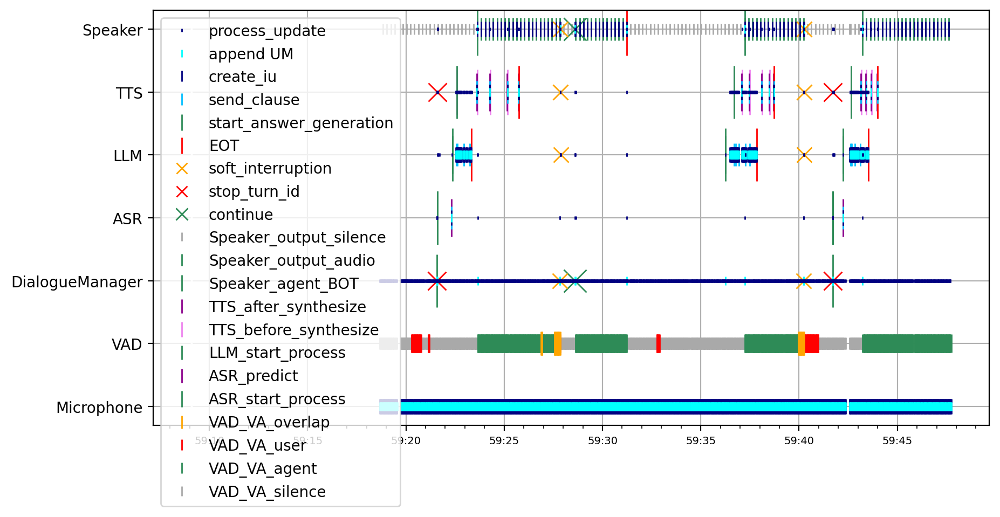

# Retico Conversational Agent (part of Articulab's Son of Sara project)

This repository is a presentation of a simple conversational agent, build upon an incremental platform for dialogue system called [retico](https://github.com/retico-team/). The agent is built to have a oral conversation  with the user, following a pre-defined scenario. This agent was developped as part of Son-of-Sara project, by [Articulab](https://articulab.hcii.cs.cmu.edu/), a multi-disciplinary cognitive science team, member of the Almanach project team, of the French public research center [Inria Paris](https://www.inria.fr/en).

This agent is composed of multiple retico modules, each providing the system with a dialogue-related capacity (comprehension, answer generation, memory, etc). Some module use deep learning models to perform complex tasks.
The system contains the following new modules :

- VAD : calculates the voice activity of the user from the audio captured by the microphone.
- ASR : predicts the transcription of the user speech, alongside with a prediction of its beginning and end of turns (using VAD information).
- LLM : generates a textual answer to the user turn, and the dialogue history (previous turns of agent and user).
- DialogueHistory : keeps the previous turns of agent and user, calculates the largest possible history and formats the previous turns into a LLM prompt with the desired template.
- TTS : generates the voice of the agent corresponding to the textual answer from the LLM.
- Speaker : outputs the voice of the agent through computer's speakers, and send agent's voice activity information to VAD.

The retico system is meant to be used with a **headphone** ! If you don't use one, the agent will be able to listen to itself and will mistake its own voice for the voice of the user (and will most likely continuously answer itself). The voice cancellation model necessary to tackle this issue is not included (yet?) in this system.

## Documentation

The documentation is available on ReadTheDocs here : [https://retico-conversational-agent.readthedocs.io](https://retico-conversational-agent.readthedocs.io/en/latest).

## Pre-requisties

- Cuda installation

## Installation

Clone the github repository

```bash
git clone https://github.com/articulab/retico-conversational-agent.git
```

Install package

```bash
cd retico-conversational-agent
pip install .
```

For a more precise installation process, to install cuda support, etc, check the documentation's [Installation page](https://retico-conversational-agent.readthedocs.io/en/latest/installation.html).

## Run the system

The package contains a main file, showing an example of how to initialize the network of modules and run the system.

### Presentation of the main file

In the `main_DM` function of this file are set some variable required by the modules :

```python
frame_length = 0.02
tts_frame_length = 0.2
rate = 16000
...
```

Logging and plotting is configured :

```python
terminal_logger, _ = retico_core.log_utils.configurate_logger(
    log_folder, filters=filters
)

# configure plot
configurate_plot(
    is_plot_live=plot_live,
    refreshing_time=1,
    plot_config_path=plot_config_path,
    window_duration=30,
)
...
```

Modules are initialized :

```python
mic = audio.MicrophoneModule()

vad = SimpleVADModule(
    input_framerate=rate,
    frame_length=frame_length,
)
...
```

Network is constructed :

```python
mic.subscribe(vad)
vad.subscribe(asr)
asr.subscribe(llm)
...
```

System is executed, until the `ENTER` key is pressed :

```python
network.run(mic)
print("Dialog system running until ENTER key is pressed")
input()
network.stop(mic)
```

### Run

To run the system, just call the main file :

```bash
python main.py
```

The system will them launch every module and start deploying the deep learning models on the GPU (or CPU if it is the option you chose).
The message `Dialog system running until ENTER key is pressed` will be printed in the terminal, to show you that the system is running.
If you speak to the system, after a short time, you should hear the system answering you.
If you want to quit, and close the system, press the `ENTER` key.

A log file will be created (in `src/retico_conversational_agent/logs/run_0/log.log` if it wasn't modified), and will receive every log message of every module during the system's execution.

A plot of the system's execution will be created (in `src/retico_conversational_agent/run_plots/run_0/plot_IU_exchange.png` if it wasn't modified), and will show information, in real time, about IUs exchanges between modules (create_iu, process_update, etc), dialogue events (user BOT, user EOT, etc), or internal events (start_generation, etc).



